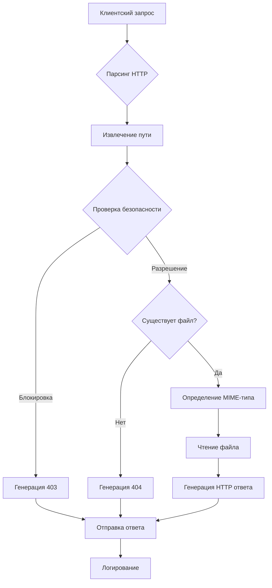
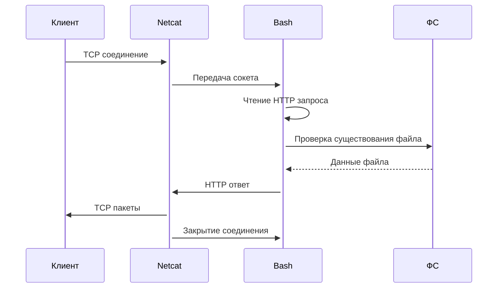

# 📚 Полная документация Uzbek Web Server (UzWS)

## Оглавление

1. [Введение](#введение)
2. [Установка](#установка)
3. [Быстрый старт](#быстрый-старт)
4. [Команды и аргументы](#команды-и-аргументы)
5. [Конфигурация](#конфигурация)
6. [Функциональность](#функциональность)
7. [Примеры использования](#примеры-использования)
8. [Разработка](#разработка)
9. [Часто задаваемые вопросы](#часто-задаваемые-вопросы)
10. [Технические детали](#технические-детали)
11. [Устранение неполадок](#устранение-неполадок)
12. [Лицензия](#лицензия)
13. [Вклад в проект](#вклад-в-проект)
14. [Благодарности](#благодарности)

## Введение

### Что такое Uzbek Web Server?

**Uzbek Web Server (UzWS)** — это минималистичный веб-сервер, написанный на чистом Bash, вдохновленный простотой `php -S` и узбекским колоритом. 🇺🇿

### Цели проекта

- ✅ **Простота**: Один bash-скрипт, никаких зависимостей
- ✅ **Легковесность**: Минимальное потребление ресурсов
- ✅ **Практичность**: Быстрый запуск для тестирования и разработки
- ✅ **Образовательность**: Понятный код для изучения работы веб-серверов

### Для кого этот проект?

- 🎓 **Начинающие разработчики**: Хотите понять, как работают веб-серверы
- 🛠 **Системные администраторы**: Нужен быстрый сервер для тестирования
- 🚀 **Фронтенд-разработчики**: Хотите быстро протестировать статические файлы
- 🇺🇿 **Энтузиасты**: Интересующиеся узбекской культурой и IT

### Основные возможности

| Возможность | Описание | Статус |
|-------------|----------|---------|
| Сервинг статических файлов | HTML, CSS, JS, изображения | ✅ Реализовано |
| Автоопределение MIME-типов | По расширению файла | ✅ Реализовано |
| Защита от directory traversal | Блокировка `../` в путях | ✅ Реализовано |
| Кастомные страницы ошибок | 404, 403 с узбекским колоритом | ✅ Реализовано |
| Логирование запросов | В реальном времени в консоль | ✅ Реализовано |
| Поддержка UTF-8 | Корректная работа с русским и узбекским | ✅ Реализовано |
| Параметры командной строки | Гибкая настройка при запуске | ✅ Реализовано |

## Установка

### Требования

**Минимальные требования:**
- **ОС**: Любой дистрибутив Linux
- **Bash**: Версия 4.0 или выше
- **Netcat**: Любая версия (обычно предустановлен)
- **Память**: ~5 MB свободной RAM
- **Диск**: ~1 MB свободного места

**Рекомендуемые требования:**
- **Bash**: Версия 5.0 или выше
- **Память**: ~10 MB свободной RAM
- **Терминал**: Поддержка цветов и UTF-8

### Проверка системы

```bash
# Проверяем версию Bash
bash --version

# Проверяем наличие netcat
nc -h || echo "Netcat не установлен"

# Проверяем версию Linux
uname -a
lsb_release -a 2>/dev/null || cat /etc/os-release
```

### Способ 1: Установка через скрипт (рекомендуется)

```bash
# Клонируем репозиторий
git clone https://github.com/ваш-username/uzbek-web-server.git
cd uzbek-web-server

# Делаем скрипт установки исполняемым
chmod +x install.sh

# Запускаем установку
./install.sh
```

**Процесс установки:**
1. ✅ Проверка системы и зависимостей
2. ✅ Копирование файлов в `~/.uzws/`
3. ✅ Создание символических ссылок в `~/.local/bin/`
4. ✅ Тестирование установки
5. ✅ Показ документации

### Способ 2: Ручная установка

```bash
# Скачиваем скрипт
curl -LO https://raw.githubusercontent.com/ваш-username/uzbek-web-server/main/uzws

# Делаем исполняемым
chmod +x uzws

# Переносим в директорию из PATH
sudo mv uzws /usr/local/bin/

# Создаем алиас
sudo ln -s /usr/local/bin/uzws /usr/local/bin/uzbekwebserver
```

### Способ 3: Установка для всех пользователей

```bash
# Клонируем репозиторий
sudo git clone https://github.com/ваш-username/uzbek-web-server.git /opt/uzws

# Создаем ссылки для всех пользователей
sudo ln -s /opt/uzws/uzws /usr/local/bin/uzws
sudo ln -s /opt/uzws/uzws /usr/local/bin/uzbekwebserver

# Настраиваем права
sudo chmod a+r /opt/uzws/*
sudo chmod a+x /opt/uzws/uzws
```

### Установка зависимостей

```bash
# Для Debian/Ubuntu
sudo apt-get update
sudo apt-get install -y netcat-openbsd

# Для CentOS/RHEL/Fedora
sudo yum install -y nc
# или
sudo dnf install -y nc

# Для Arch Linux
sudo pacman -S --noconfirm netcat

# Для openSUSE
sudo zypper install -y netcat-openbsd

# Для macOS (через Homebrew)
brew install netcat
```

### Проверка установки

```bash
# Проверяем доступность команд
which uzws
which uzbekwebserver

# Проверяем версию
uzws --version

# Тестируем справку
uzws --help
```

### Обновление

```bash
# Способ 1: Через git
cd ~/.uzws
git pull origin main

# Способ 2: Переустановка
./uninstall.sh
./install.sh
```

### Удаление

```bash
# Запускаем скрипт удаления
./uninstall.sh

# Или вручную
rm -rf ~/.uzws
rm -f ~/.local/bin/uzws
rm -f ~/.local/bin/uzbekwebserver
rm -f ~/.local/bin/uzws-server
```

## Быстрый старт

### Первый запуск

```bash
# Создаем тестовую директорию
mkdir ~/my-first-site
cd ~/my-first-site

# Создаем простой HTML файл
cat > index.html << 'EOF'
<!DOCTYPE html>
<html>
<head>
    <title>Мой первый сайт на UzWS</title>
</head>
<body>
    <h1>Привет, мир! 🚀</h1>
    <p>Uzbek Web Server работает!</p>
</body>
</html>
EOF

# Запускаем сервер
uzws
```

### Открытие в браузере

После запуска откройте браузер и перейдите по адресу:
- **Локально**: `http://localhost:8080`
- **Сети**: `http://ваш-ip-адрес:8080`

### Стоп сервер

Для остановки сервера нажмите:
```
Ctrl + C
```

### Пример с пользовательским портом

```bash
# Запуск на порту 3000
uzws 3000

# Запуск на порту 80 (требует sudo)
sudo uzws 80
```

## Команды и аргументы

### Основной синтаксис

```bash
uzws [ПОРТ] [ДИРЕКТОРИЯ] [ОПЦИИ]
```

### Алиасы

UzWS поддерживает несколько имен команд:

| Команда | Описание | Пример |
|---------|----------|---------|
| `uzws` | Основная команда | `uzws 8080 ./public` |
| `uzbekwebserver` | Полное имя | `uzbekwebserver 8080` |
| `uzws-server` | Альтернативное имя | `uzws-server --help` |

### Аргументы командной строки

#### Позиционные аргументы

```bash
# Только порт (директория = текущая)
uzws 3000

# Порт и директория
uzws 8080 ./public

# Только директория (порт = 8080)
uzws ./my-site
```

#### Флаги и опции

| Флаг | Алиас | Описание | Пример |
|------|-------|----------|---------|
| `--help` | `-h` | Показать справку | `uzws --help` |
| `--version` | `-v` | Показать версию | `uzws --version` |
| `--port` | `-p` | Указать порт | `uzws --port 3000` |
| `--directory` | `-d` | Указать директорию | `uzws -d ./public` |
| `--no-banner` | `-nb` | Отключить баннер | `uzws --no-banner` |
| `--no-log` | `-nl` | Отключить логирование | `uzws --no-log` |
| `--silent` | `-s` | Тихий режим | `uzws --silent` |
| `--config` | `-c` | Указать конфиг | `uzws --config ~/.uzws/my-config` |

### Примеры использования флагов

```bash
# Минималистичный запуск (без баннера)
uzws --no-banner 8080 ./site

# Тихий режим для скриптов
uzws --silent 3000 > /dev/null 2>&1 &

# Указание конфигурационного файла
uzws --config ~/.uzws/production-config

# Комбинация флагов
uzws -p 9000 -d /var/www -nl
```

### Переменные окружения

UzWS поддерживает настройку через переменные окружения:

```bash
# Установка порта через переменную
export UZWS_PORT=3000
uzws

# Установка директории
export UZWS_DIRECTORY=./public
uzws

# Отключение баннера
export UZWS_NO_BANNER=1
uzws

# Все настройки сразу
export UZWS_PORT=4000
export UZWS_DIRECTORY=/opt/site
export UZWS_NO_LOG=1
uzws
```

**Приоритет настроек (от высшего к низшему):**
1. Аргументы командной строки
2. Переменные окружения
3. Конфигурационный файл
4. Значения по умолчанию

## Конфигурация

### Конфигурационный файл

По умолчанию конфигурация хранится в `~/.uzws/config`:

```bash
# Основные настройки Uzbek Web Server
# Этот файл автоматически генерируется при установке

# Основные настройки
SERVER_NAME="Uzbek Web Server"
SERVER_VERSION="2.0"
DEFAULT_PORT="8080"
DEFAULT_DIR="."

# Настройки логирования
LOG_REQUESTS="true"
LOG_FORMAT="[%TIME%] %METHOD% %PATH% -> %STATUS%"
LOG_COLORS="true"

# Настройки безопасности
ENABLE_TRAVERSAL_PROTECTION="true"
ALLOWED_EXTENSIONS="html,htm,css,js,json,jpg,jpeg,png,gif,svg,ico,txt"

# Настройки вывода
SHOW_BANNER="true"
SHOW_WELCOME="true"
USE_COLORS="true"
USE_EMOJIS="true"

# Настройки HTTP
DEFAULT_MIME="application/octet-stream"
ENABLE_CACHE_HEADERS="false"
CACHE_MAX_AGE="3600"

# Язык
LANGUAGE="ru"
```

### Создание пользовательского конфига

```bash
# Копируем стандартный конфиг
cp ~/.uzws/config ~/.uzws/my-config

# Редактируем
nano ~/.uzws/my-config

# Запускаем с пользовательским конфигом
uzws --config ~/.uzws/my-config
```

### Параметры конфигурационного файла

#### Основные настройки
| Параметр | Тип | Значение по умолчанию | Описание |
|----------|-----|----------------------|----------|
| `SERVER_NAME` | string | "Uzbek Web Server" | Имя сервера в HTTP-заголовках |
| `SERVER_VERSION` | string | "2.0" | Версия сервера |
| `DEFAULT_PORT` | number | 8080 | Порт по умолчанию |
| `DEFAULT_DIR` | string | "." | Директория по умолчанию |

#### Настройки логирования
| Параметр | Тип | Значение по умолчанию | Описание |
|----------|-----|----------------------|----------|
| `LOG_REQUESTS` | boolean | true | Логировать ли запросы |
| `LOG_FORMAT` | string | "[%TIME%] %METHOD% %PATH% -> %STATUS%" | Формат лога |
| `LOG_COLORS` | boolean | true | Использовать цвета в логах |

#### Настройки безопасности
| Параметр | Тип | Значение по умолчанию | Описание |
|----------|-----|----------------------|----------|
| `ENABLE_TRAVERSAL_PROTECTION` | boolean | true | Защита от directory traversal |
| `ALLOWED_EXTENSIONS` | string | "html,htm,css,js,json,jpg,jpeg,png,gif,svg,ico,txt" | Разрешенные расширения |

#### Настройки вывода
| Параметр | Тип | Значение по умолчанию | Описание |
|----------|-----|----------------------|----------|
| `SHOW_BANNER` | boolean | true | Показывать баннер при запуске |
| `SHOW_WELCOME` | boolean | true | Показывать приветственное сообщение |
| `USE_COLORS` | boolean | true | Использовать цвета в выводе |
| `USE_EMOJIS` | boolean | true | Использовать эмодзи |

#### Настройки HTTP
| Параметр | Тип | Значение по умолчанию | Описание |
|----------|-----|----------------------|----------|
| `DEFAULT_MIME` | string | "application/octet-stream" | MIME-тип по умолчанию |
| `ENABLE_CACHE_HEADERS` | boolean | false | Добавлять заголовки кэширования |
| `CACHE_MAX_AGE` | number | 3600 | Максимальное время кэширования (сек) |

### Переменные формата логов

В параметре `LOG_FORMAT` можно использовать следующие переменные:

| Переменная | Описание | Пример |
|------------|----------|---------|
| `%TIME%` | Время запроса | 14:30:25 |
| `%DATE%` | Дата запроса | 2024-01-15 |
| `%METHOD%` | HTTP метод | GET |
| `%PATH%` | Путь запроса | /index.html |
| `%STATUS%` | HTTP статус | 200 OK |
| `%CLIENT%` | IP клиента | 127.0.0.1 |
| `%BYTES%` | Размер ответа | 1024 |

**Примеры форматов:**
```bash
# Простой формат
LOG_FORMAT="[%TIME%] %METHOD% %PATH%"

# Подробный формат
LOG_FORMAT="%DATE% %TIME% | %CLIENT% | %METHOD% %PATH% -> %STATUS% (%BYTES% bytes)"

# JSON формат (для парсинга)
LOG_FORMAT='{"time":"%TIME%","method":"%METHOD%","path":"%PATH%","status":"%STATUS%"}'
```

### Языковые настройки

Поддерживается несколько языков через параметр `LANGUAGE`:

```bash
# Русский (по умолчанию)
LANGUAGE="ru"

# Английский
LANGUAGE="en"

# Узбекский
LANGUAGE="uz"
```

Для добавления нового языка создайте файл перевода в `~/.uzws/languages/`.

## Функциональность

### Обслуживание файлов

#### Поддерживаемые MIME-типы

UzWS автоматически определяет MIME-типы по расширению файла:

| Расширение | MIME-тип | Кодировка |
|------------|----------|-----------|
| `.html`, `.htm` | `text/html` | `charset=utf-8` |
| `.css` | `text/css` | `charset=utf-8` |
| `.js` | `application/javascript` | `charset=utf-8` |
| `.json` | `application/json` | `charset=utf-8` |
| `.txt` | `text/plain` | `charset=utf-8` |
| `.jpg`, `.jpeg` | `image/jpeg` | - |
| `.png` | `image/png` | - |
| `.gif` | `image/gif` | - |
| `.svg` | `image/svg+xml` | - |
| `.ico` | `image/x-icon` | - |
| `.pdf` | `application/pdf` | - |
| `.zip` | `application/zip` | - |
| `.mp3` | `audio/mpeg` | - |
| `.mp4` | `video/mp4` | - |
| *остальные* | `application/octet-stream` | - |

#### Index файлы

При запросе к директории UzWS ищет следующие файлы по порядку:
1. `index.html`
2. `index.htm`
3. `default.html`
4. `home.html`

Пример структуры:
```
public/
├── index.html          # Будет отображен при запросе /
├── css/
│   └── style.css
├── js/
│   └── app.js
└── images/
    └── logo.png
```

### HTTP методы

#### Поддерживаемые методы

| Метод | Поддерживается | Описание |
|-------|---------------|----------|
| `GET` | ✅ Да | Получение ресурсов |
| `HEAD` | ⚠️ Частично | Заголовки без тела |
| `POST` | ❌ Нет | Отправка данных |
| `PUT` | ❌ Нет | Обновление ресурсов |
| `DELETE` | ❌ Нет | Удаление ресурсов |
| `OPTIONS` | ❌ Нет | Опции запроса |

**Примечание:** UzWS в первую очередь предназначен для обслуживания статических файлов, поэтому поддерживает только `GET` и частично `HEAD`.

#### Обработка GET запросов

```bash
# Пример запроса
GET /index.html HTTP/1.1
Host: localhost:8080
User-Agent: curl/7.68.0
Accept: */*

# Ответ UzWS
HTTP/1.1 200 OK
Server: UzWS/2.0 (Uzbek Web Server)
Content-Type: text/html; charset=utf-8
Content-Length: 1234
Connection: close
X-Powered-By: Plov, Non и Uzbek Tea

<!DOCTYPE html>...
```

### Обработка ошибок

#### Коды состояния HTTP

| Код | Сообщение | Когда возникает | Страница ошибки |
|-----|-----------|----------------|-----------------|
| 200 | OK | Успешный запрос | - |
| 400 | Bad Request | Некорректный запрос | ⚠️ Не реализовано |
| 403 | Forbidden | Доступ запрещен | ✅ Кастомная страница |
| 404 | Not Found | Файл не найден | ✅ Кастомная страница |
| 500 | Internal Server Error | Ошибка сервера | ⚠️ Не реализовано |

#### Страница 403 Forbidden

Возникает при:
- Попытке directory traversal (`../`, `/etc/passwd`)
- Доступе к скрытым файлам (`.htaccess`, `.git`)
- Доступе к системным путям

**Содержание страницы 403:**
- Код ошибки: 403
- Сообщение: "Доступ запрещен!"
- Описание: Информация о причине блокировки
- Эмодзи: 🚫 или 🛑

#### Страница 404 Not Found

Возникает при:
- Запросе несуществующего файла
- Запросе к несуществующей директории

**Содержание страницы 404:**
- Код ошибки: 404
- Сообщение: "Страница не найдена!"
- Эмодзи: 🍚 (плов) или 🔍
- Элементы узбекской культуры

### Безопасность

#### Защита от Directory Traversal

UzWS блокирует попытки выйти за пределы корневой директории:

```bash
# Блокируются:
GET /../../etc/passwd
GET /../secret.txt
GET //absolute/path

# Разрешаются:
GET /images/photo.jpg
GET /css/style.css
GET /../ (нормализуется в /)
```

**Реализация защиты:**
```bash
# В коде сервера
if [[ "$path" == *..* || "$path" == /* ]]; then
    send_403_error
fi
```

#### Ограничение расширений файлов

Через конфигурацию можно ограничить разрешенные расширения:

```bash
# Разрешить только безопасные расширения
ALLOWED_EXTENSIONS="html,htm,css,js,json,jpg,jpeg,png,gif"
```

#### Заголовки безопасности HTTP

UzWS отправляет следующие заголовки:

```http
Server: UzWS/2.0 (Uzbek Web Server)
X-Powered-By: Plov, Non и Uzbek Tea
X-Content-Type-Options: nosniff
X-Frame-Options: DENY
```

### Производительность

#### Кэширование

Для статических файлов UzWS может отправлять заголовки кэширования:

```bash
# Включить в конфиге
ENABLE_CACHE_HEADERS="true"
CACHE_MAX_AGE="3600"

# Отправляемые заголовки
Cache-Control: public, max-age=3600
Expires: [дата через 1 час]
```

#### Сжатие (Gzip)

⚠️ **В разработке:** Планируется добавление сжатия для текстовых файлов.

#### Keep-Alive соединения

❌ **Не поддерживается:** Каждое соединение закрывается после обработки запроса.

### Мониторинг и логирование

#### Формат логов

По умолчанию логи выводятся в формате:
```
[14:30:25] GET /index.html -> 200 OK
[14:30:26] GET /style.css -> 200 OK
[14:30:27] GET /nonexistent.html -> 404 Not Found
```

#### Настройка уровня логирования

```bash
# В конфигурационном файле
LOG_LEVEL="INFO"  # ERROR, WARN, INFO, DEBUG

# Примеры логов разных уровней
# ERROR: Критические ошибки
# WARN:  Предупреждения
# INFO:  Информация (по умолчанию)
# DEBUG: Отладочная информация
```

#### Логирование в файл

```bash
# Перенаправление вывода
uzws 8080 ./site >> ~/.uzws/server.log 2>&1

# Ротация логов (пример)
logrotate -f ~/.uzws/logrotate.conf
```

## Примеры использования

### Базовые примеры

#### Пример 1: Быстрый старт разработки

```bash
# Переходим в директорию проекта
cd ~/projects/my-website

# Запускаем сервер
uzws

# Открываем браузер
xdg-open http://localhost:8080
# или
firefox http://localhost:8080
```

#### Пример 2: Тестирование разных портов

```bash
# Тестируем порт 3000 (популярный для Node.js)
uzws 3000

# Тестируем порт 8000 (популярный для Python)
uzws 8000

# Тестируем порт 80 (HTTP по умолчанию, нужен sudo)
sudo uzws 80
```

#### Пример 3: Обслуживание разных директорий

```bash
# Статический сайт
uzws 8080 /var/www/html

# Документация проекта
uzws 4000 ./docs/build

# Ресурсы для мобильного приложения
uzws 9000 ./app/src/main/assets
```

### Продвинутые примеры

#### Пример 4: Интеграция с системами сборки

```bash
#!/bin/bash
# build-and-serve.sh

# Собираем проект
npm run build

# Запускаем сервер в фоне
uzws 8080 ./dist > server.log 2>&1 &
SERVER_PID=$!

echo "Сервер запущен на http://localhost:8080"
echo "Логи в server.log"
echo "PID: $SERVER_PID"

# Ждем нажатия Enter
read -p "Нажмите Enter для остановки..."

# Останавливаем сервер
kill $SERVER_PID
echo "Сервер остановлен"
```

#### Пример 5: Мониторинг изменений файлов

```bash
#!/bin/bash
# watch-and-serve.sh

# Используем inotifywait для отслеживания изменений
while true; do
    # Запускаем сервер
    uzws 8080 . &
    SERVER_PID=$!
    
    # Ждем изменения файлов
    inotifywait -r -e modify,move,create,delete .
    
    # Останавливаем сервер
    kill $SERVER_PID 2>/dev/null
    wait $SERVER_PID 2>/dev/null
    
    echo "Файлы изменены, перезапускаем сервер..."
    sleep 1
done
```

#### Пример 6: Несколько серверов одновременно

```bash
#!/bin/bash
# multiple-servers.sh

# Запускаем API документацию
uzws 3001 ./api-docs > api-docs.log 2>&1 &
API_PID=$!

# Запускаем UI
uzws 3002 ./ui-dist > ui.log 2>&1 &
UI_PID=$!

# Запускаем статику
uzws 3003 ./static > static.log 2>&1 &
STATIC_PID=$!

echo "Серверы запущены:"
echo "  API Docs: http://localhost:3001 (PID: $API_PID)"
echo "  UI:       http://localhost:3002 (PID: $UI_PID)"
echo "  Static:   http://localhost:3003 (PID: $STATIC_PID)"
echo ""
echo "Логи: api-docs.log, ui.log, static.log"
echo ""
read -p "Нажмите Enter для остановки всех серверов..."

kill $API_PID $UI_PID $STATIC_PID
echo "Все серверы остановлены"
```

#### Пример 7: Проксирование для разработки

```bash
#!/bin/bash
# dev-proxy.sh

# Запускаем фронтенд
uzws 3000 ./frontend-dist &
FRONTEND_PID=$!

# Запускаем бэкенд (Node.js пример)
node server.js &
BACKEND_PID=$!

# Простой прокси на bash (базовый пример)
while true; do
    {
        read -r request
        path=$(echo "$request" | awk '{print $2}')
        
        # Проксируем API запросы на бэкенд
        if [[ "$path" == /api/* ]]; then
            # Перенаправляем на бэкенд (упрощенный пример)
            echo "HTTP/1.1 200 OK"
            echo "Content-Type: application/json"
            echo ""
            echo '{"message": "API через прокси"}'
        else
            # Отдаем статику с фронтенда
            echo "HTTP/1.1 200 OK"
            echo "Content-Type: text/html"
            echo ""
            cat ./frontend-dist/index.html
        fi
    } | nc -l -p 8080 -q 1
done &

PROXY_PID=$!

echo "Dev окружение запущено:"
echo "  Frontend: http://localhost:3000"
echo "  Backend:  http://localhost:3001"
echo "  Proxy:    http://localhost:8080"
echo ""
echo "Для остановки нажмите Ctrl+C"

trap "kill $FRONTEND_PID $BACKEND_PID $PROXY_PID" EXIT
wait
```

### Примеры для специфических случаев

#### Пример 8: Локальная документация

```bash
# Документация в Markdown
uzws 4000 ./docs

# Документация API (Swagger/OpenAPI)
uzws 3000 ./swagger-ui-dist

# Javadoc/Doxygen документация
uzws 5000 ./javadoc
```

#### Пример 9: Демонстрация прототипов

```bash
# Прототип мобильного приложения
uzws 8080 ./prototype

# А/Б тестирование интерфейсов
uzws 3000 ./variant-a &
uzws 3001 ./variant-b &

echo "Вариант A: http://localhost:3000"
echo "Вариант B: http://localhost:3001"
```

#### Пример 10: Образовательные цели

```bash
# Демонстрация работы веб-сервера студентам
uzws --no-banner 8080 ./examples

# Логирование всех запросов для анализа
uzws 8080 . 2>&1 | tee server-requests.log
```

### Интеграция с другими инструментами

#### Пример 11: Docker контейнер

```dockerfile
# Dockerfile
FROM alpine:latest

RUN apk add --no-cache bash netcat-openbsd

COPY uzws /usr/local/bin/uzws
RUN chmod +x /usr/local/bin/uzws

WORKDIR /app
COPY . /app

EXPOSE 8080

CMD ["uzws", "8080", "."]
```

```bash
# Сборка и запуск
docker build -t uzws-server .
docker run -p 8080:8080 -v $(pwd):/app uzws-server
```

#### Пример 12: Systemd сервис

```ini
# /etc/systemd/system/uzws.service
[Unit]
Description=Uzbek Web Server
After=network.target

[Service]
Type=simple
User=www-data
WorkingDirectory=/var/www/html
ExecStart=/usr/local/bin/uzws 8080 .
Restart=on-failure
RestartSec=5

[Install]
WantedBy=multi-user.target
```

```bash
# Управление сервисом
sudo systemctl daemon-reload
sudo systemctl start uzws
sudo systemctl enable uzws
sudo systemctl status uzws
```

#### Пример 13: Интеграция с Nginx

```nginx
# nginx.conf - реверс-прокси к UzWS
server {
    listen 80;
    server_name example.com;
    
    location / {
        proxy_pass http://localhost:8080;
        proxy_set_header Host $host;
        proxy_set_header X-Real-IP $remote_addr;
    }
    
    location /api/ {
        # API запросы к другому сервису
        proxy_pass http://localhost:3000;
    }
}
```

## Разработка

### Архитектура UzWS

#### Компоненты системы

```
┌─────────────────────────────────────────────┐
│                Uzbek Web Server             │
├─────────────────────────────────────────────┤
│  Основные компоненты:                       │
│  1. Парсер аргументов командной строки      │
│  2. Загрузчик конфигурации                  │
│  3. HTTP парсер запросов                    │
│  4. Менеджер MIME-типов                     │
│  5. Обработчик файловой системы             │
│  6. Генератор HTTP ответов                  │
│  7. Логгер                                  │
│  8. Система безопасности                    │
└─────────────────────────────────────────────┘
```

#### Поток обработки запроса



### Структура кода

#### Основные функции

```bash
# Главные функции в uzws
main()                      # Точка входа
parse_arguments()           # Парсинг аргументов
load_config()              # Загрузка конфигурации
start_server()             # Запуск сервера
handle_request()           # Обработка запроса
parse_http_request()       # Парсинг HTTP
sanitize_path()            # Очистка пути
get_mime_type()            # Определение MIME-типа
send_response()            # Отправка ответа
send_error()               # Отправка ошибки
log_request()              # Логирование
```

#### Переменные окружения

```bash
# Внутренние переменные
declare -g SERVER_PORT     # Порт сервера
declare -g SERVER_DIR      # Корневая директория
declare -g CONFIG_FILE     # Файл конфигурации
declare -g LOG_LEVEL       # Уровень логирования
declare -g MIME_TYPES      # Ассоциативный массив MIME-типов

# Константы
readonly VERSION="2.0"
readonly DEFAULT_PORT=8080
readonly DEFAULT_DIR="."
```

### Расширение функциональности

#### Добавление нового MIME-типа

```bash
# В коде сервера, в функции get_mime_type()
case "$path" in
    # Существующие типы...
    *.webp)          mime="image/webp" ;;
    *.woff)          mime="font/woff" ;;
    *.woff2)         mime="font/woff2" ;;
    *.ttf)           mime="font/ttf" ;;
    # Новые типы добавлять здесь
    *.md|*.markdown) mime="text/markdown; charset=utf-8" ;;
    *.yaml|*.yml)    mime="application/x-yaml" ;;
    *)               mime="$DEFAULT_MIME" ;;
esac
```

#### Добавление новой страницы ошибки

```bash
# Функция send_error()
send_error() {
    local status_code="$1"
    local message="$2"
    
    case "$status_code" in
        400) cat << EOF
HTTP/1.1 400 Bad Request
Content-Type: text/html

<!DOCTYPE html>
<html><body>
<h1>400 - Неверный запрос</h1>
<p>$message</p>
</body></html>
EOF
        ;;
        # Добавлять новые коды ошибок здесь
        500) send_500_error ;;
        503) send_503_error ;;
        *)   send_generic_error ;;
    esac
}
```

#### Добавление поддержки HTTP метода

```bash
# В функции parse_http_request()
parse_http_request() {
    read -r request_line
    local method=$(echo "$request_line" | awk '{print $1}')
    
    case "$method" in
        GET)    handle_get_request ;;
        HEAD)   handle_head_request ;;
        POST)   handle_post_request ;;  # Новая поддержка
        # Добавлять новые методы здесь
        OPTIONS) handle_options_request ;;
        *)      send_error 405 "Метод $method не поддерживается" ;;
    esac
}
```

### Тестирование

#### Юнит-тесты

```bash
#!/bin/bash
# tests/unit-tests.sh

test_mime_type_detection() {
    echo "Тест: Определение MIME-типов"
    
    assert "$(get_mime_type test.html)" = "text/html"
    assert "$(get_mime_type style.css)" = "text/css"
    assert "$(get_mime_type script.js)" = "application/javascript"
    
    echo "✅ Все тесты MIME-типов пройдены"
}

test_path_sanitization() {
    echo "Тест: Очистка путей"
    
    assert "$(sanitize_path /etc/passwd)" = "403"
    assert "$(sanitize_path ../secret)" = "403"
    assert "$(sanitize_path normal/path)" = "normal/path"
    
    echo "✅ Все тесты очистки путей пройдены"
}

# Запуск всех тестов
run_all_tests() {
    test_mime_type_detection
    test_path_sanitization
    # Добавлять новые тесты здесь
}
```

#### Интеграционные тесты

```bash
#!/bin/bash
# tests/integration-tests.sh

test_server_startup() {
    echo "Тест: Запуск сервера"
    
    # Запускаем сервер в фоне
    uzws 9999 ./test-site > test.log 2>&1 &
    local pid=$!
    sleep 2
    
    # Проверяем, что сервер запустился
    if curl -s http://localhost:9999 > /dev/null; then
        echo "✅ Сервер запущен успешно"
    else
        echo "❌ Ошибка запуска сервера"
    fi
    
    # Останавливаем сервер
    kill $pid
    wait $pid 2>/dev/null
}

test_file_serving() {
    echo "Тест: Обслуживание файлов"
    
    # Создаем тестовый файл
    echo "Test content" > test-site/test.txt
    
    # Запускаем сервер
    uzws 9998 ./test-site > /dev/null 2>&1 &
    local pid=$!
    sleep 2
    
    # Запрашиваем файл
    local response=$(curl -s http://localhost:9998/test.txt)
    
    if [[ "$response" = "Test content" ]]; then
        echo "✅ Файлы обслуживаются корректно"
    else
        echo "❌ Ошибка обслуживания файлов"
    fi
    
    kill $pid
}

run_integration_tests() {
    test_server_startup
    test_file_serving
}
```

#### Тестирование производительности

```bash
#!/bin/bash
# tests/benchmark.sh

benchmark_small_files() {
    echo "Бенчмарк: Маленькие файлы (1KB)"
    
    # Создаем 100 маленьких файлов
    for i in {1..100}; do
        head -c 1024 /dev/urandom > "benchmark/small-$i.dat"
    done
    
    # Запускаем сервер
    uzws 7777 ./benchmark > /dev/null 2>&1 &
    local pid=$!
    sleep 2
    
    # Тестируем
    time for i in {1..100}; do
        curl -s http://localhost:7777/small-$i.dat > /dev/null
    done
    
    kill $pid
}

benchmark_concurrent_requests() {
    echo "Бенчмарк: Конкурентные запросы"
    
    uzws 7776 ./benchmark > /dev/null 2>&1 &
    local pid=$!
    sleep 2
    
    # 10 одновременных запросов
    time for i in {1..10}; do
        curl -s http://localhost:7776/large.dat > /dev/null &
    done
    wait
    
    kill $pid
}
```

### Отладка

#### Включение режима отладки

```bash
# Запуск с отладочным выводом
bash -x uzws 8080 .

# Или добавить в скрипт
set -x  # Включить отладку
# код...
set +x  # Выключить отладку
```

#### Логирование отладки в файл

```bash
# В коде сервера
debug() {
    if [[ "$DEBUG" = "true" ]]; then
        echo "[DEBUG] $@" >> debug.log
    fi
}

# Использование
debug "Обработка запроса: $request"
debug "Путь: $path, MIME: $mime"
```

#### Анализ дампа памяти

```bash
# Мониторинг использования памяти
while true; do
    ps aux | grep uzws | grep -v grep
    sleep 5
done

# Или с подробной информацией
watch -n 1 'ps -o pid,ppid,cmd,%mem,%cpu -p $(pgrep -f uzws)'
```

## Часто задаваемые вопросы

### Общие вопросы

#### ❓ В чем отличие UzWS от других веб-серверов?

| Сервер | Язык | Вес | Простота | Цель |
|--------|------|-----|----------|------|
| **UzWS** | Bash | ~1MB | ✅ Очень простой | Тестирование, обучение |
| **nginx** | C | ~5MB | ⚠️ Средняя | Продвинутое использование |
| **Apache** | C | ~10MB | ❌ Сложный | Корпоративное использование |
| **python -m http.server** | Python | ~30MB | ✅ Простой | Быстрый запуск |

#### ❓ Почему именно Bash?

1. **Универсальность**: Bash есть на всех Linux системах
2. **Прозрачность**: Код легко читать и понимать
3. **Образовательность**: Хорошо показывает основы работы HTTP
4. **Минимализм**: Никаких дополнительных зависимостей

#### ❓ Какие ограничения у UzWS?

1. **Только статические файлы**: Нет поддержки PHP, Python и т.д.
2. **Нет многопоточности**: Один запрос за раз
3. **Безопасность**: Базовая защита, не для продакшена
4. **Производительность**: Только для легких нагрузок

### Технические вопросы

#### ❓ Почему сервер не запускается на порту 80?

```bash
# Порты ниже 1024 требуют прав root
sudo uzws 80

# Или перенаправьте порт
sudo iptables -t nat -A PREROUTING -p tcp --dport 80 -j REDIRECT --to-port 8080
uzws 8080
```

#### ❓ Как обслуживать несколько доменов?

```bash
# Через разные порты
uzws 8080 ./site1  # example.com:8080
uzws 8081 ./site2  # example.org:8081

# Или используйте обратный прокси (nginx/apache)
```

#### ❓ Поддерживается ли HTTPS?

❌ **Нет**, но вы можете использовать:

1. **stunnel**: Прокси с TLS
2. **nginx**: Обратный прокси с SSL
3. **Caddy**: Автоматический HTTPS

Пример с stunnel:
```bash
# Установка
sudo apt-get install stunnel4

# Конфигурация
cat > /etc/stunnel/uzws.conf << EOF
[uzws]
accept = 443
connect = 8080
cert = /etc/ssl/certs/uzws.pem
EOF

# Запуск
uzws 8080 .
sudo stunnel /etc/stunnel/uzws.conf
```

#### ❓ Как добавить базовую аутентификацию?

```bash
# Модификация кода сервера
check_auth() {
    local auth_header=$(grep -i "Authorization:" | head -1)
    
    if [[ "$auth_header" != *"Basic $(echo -n 'user:pass' | base64)"* ]]; then
        send_error 401 "Требуется аутентификация"
        return 1
    fi
    return 0
}
```

### Проблемы и решения

#### ❓ Ошибка: "Port already in use"

```bash
# Найдите процесс, использующий порт
sudo lsof -i :8080

# Убейте процесс
sudo kill -9 <PID>

# Или используйте другой порт
uzws 8081
```

#### ❓ Ошибка: "Permission denied"

```bash
# Дайте права на выполнение
chmod +x uzws

# Или запустите с sudo
sudo uzws 8080

# Проверьте права на директорию
ls -la ./public
chmod +r ./public/*
```

#### ❓ Файлы не отображаются правильно

```bash
# Проверьте MIME-типы
curl -I http://localhost:8080/file.css

# Проверьте кодировку
file -i index.html

# Убедитесь в правильности расширений
mv file file.html
```

#### ❓ Сервер падает при большом количестве запросов

```bash
# Увеличьте лимиты netcat
uzws 8080 . &
SERVER_PID=$!

# Мониторинг
while true; do
    if ! ps -p $SERVER_PID > /dev/null; then
        echo "Сервер упал, перезапускаю..."
        uzws 8080 . &
        SERVER_PID=$!
    fi
    sleep 5
done
```

### Вопросы производительности

#### ❓ Сколько пользователей может обслуживать UzWS?

**Ориентировочные лимиты:**
- **Одновременные пользователи**: 5-10
- **Запросов в секунду**: 10-20
- **Максимальный размер файла**: ~100MB
- **Рекомендуемое применение**: Тестирование, локальная разработка

#### ❓ Как улучшить производительность?

```bash
# 1. Используйте кэширование браузера
# 2. Минимизируйте файлы (CSS, JS)
# 3. Используйте CDN для статики
# 4. Включите сжатие через nginx
```

## Технические детали

### HTTP/1.1 Реализация

#### Поддерживаемые заголовки

| Заголовок | Отправляется | Обрабатывается |
|-----------|--------------|----------------|
| Host | ❌ Нет | ✅ Да |
| User-Agent | ❌ Нет | ✅ Да (логирование) |
| Accept | ❌ Нет | ❌ Нет |
| Content-Type | ✅ Да | ❌ Нет |
| Content-Length | ✅ Да | ❌ Нет |
| Connection | ✅ Да (close) | ✅ Да |
| Server | ✅ Да (UzWS/2.0) | ❌ Нет |

#### Формат HTTP ответа

```http
HTTP/1.1 200 OK
Server: UzWS/2.0 (Uzbek Web Server)
Content-Type: text/html; charset=utf-8
Content-Length: 1234
Connection: close
X-Powered-By: Plov, Non и Uzbek Tea

<тело ответа>
```

### Сетевой стек

#### Использование netcat

```bash
# Базовый цикл сервера
while true; do
    {
        # Чтение запроса
        read -r request
        
        # Обработка...
        echo "HTTP/1.1 200 OK"
        echo "Content-Type: text/html"
        echo ""
        echo "<html>...</html>"
    } | nc -l -p "$PORT" -q 1
done
```

**Параметры netcat:**
- `-l` режим прослушивания
- `-p` порт
- `-q 1` ждать 1 секунду после EOF

#### Обработка соединений



### Файловая система

#### Работа с путями

```bash
# Нормализация пути
normalize_path() {
    local path="$1"
    
    # Удаляем начальный /
    path="${path#/}"
    
    # Заменяем множественные /
    path=$(echo "$path" | tr -s '/')
    
    # Убираем ./
    path="${path#./}"
    
    echo "$path"
}
```

#### Кэширование файлов в памяти

⚠️ **В разработке:**
```bash
declare -A FILE_CACHE

cache_file() {
    local path="$1"
    
    if [[ -z "${FILE_CACHE[$path]}" ]]; then
        FILE_CACHE["$path"]=$(cat "$path")
    fi
    
    echo "${FILE_CACHE[$path]}"
}
```

### Безопасность

#### Проверка путей

```bash
is_path_safe() {
    local path="$1"
    
    # Запрещенные паттерны
    local unsafe_patterns=(
        ".."
        "/etc/"
        "/proc/"
        "/dev/"
        "~"
        "//"
    )
    
    for pattern in "${unsafe_patterns[@]}"; do
        if [[ "$path" == *"$pattern"* ]]; then
            return 1
        fi
    done
    
    return 0
}
```

#### Ограничение доступа по IP

```bash
# В конфигурации
ALLOWED_IPS="127.0.0.1,192.168.1.0/24"

# Проверка
check_ip() {
    local client_ip="$1"
    
    # Простая проверка (можно улучшить)
    if [[ "$ALLOWED_IPS" != *"$client_ip"* ]]; then
        send_error 403 "Доступ запрещен с вашего IP"
        return 1
    fi
    
    return 0
}
```

## Устранение неполадок

### Диагностические команды

#### Проверка запуска сервера

```bash
# Простой тест
curl -I http://localhost:8080

# Подробный тест
curl -v http://localhost:8080

# Тест с таймаутом
timeout 5 curl http://localhost:8080 || echo "Сервер не отвечает"
```

#### Мониторинг сети

```bash
# Какие порты слушает сервер?
sudo netstat -tulpn | grep :8080

# Или
sudo ss -tulpn | grep :8080

# Статистика соединений
sudo netstat -an | grep :8080 | wc -l
```

#### Логирование сетевого трафика

```bash
# Просмотр HTTP запросов в реальном времени
sudo tcpdump -i lo -A port 8080 2>/dev/null | grep -E "(GET|POST|HTTP)"

# Или с помощью ngrep
sudo ngrep -d lo port 8080
```

### Распространенные ошибки

#### Ошибка: "nc: command not found"

```bash
# Решение: Установите netcat
# Debian/Ubuntu:
sudo apt-get install netcat-openbsd

# Проверьте установку:
which nc
nc -h
```

#### Ошибка: "Address already in use"

```bash
# Решение 1: Освободите порт
sudo fuser -k 8080/tcp

# Решение 2: Используйте другой порт
uzws 8081

# Решение 3: Подождите (иногда система держит порт)
sleep 2
uzws 8080
```

#### Ошибка: "Permission denied"

```bash
# Решение 1: Проверьте права
ls -la uzws
chmod +x uzws

# Решение 2: Запустите с правами root
sudo uzws 80

# Решение 3: Проверьте доступ к директории
ls -la ./public
chmod +rx ./public
```

#### Ошибка: "File not found" при существующем файле

```bash
# Решение 1: Проверьте путь
realpath ./index.html
uzws 8080 $(realpath .)

# Решение 2: Используйте абсолютный путь
uzws 8080 /full/path/to/site

# Решение 3: Проверьте симлинки
ls -la ./public
```

### Расширенная диагностика

#### Профилирование Bash скрипта

```bash
# Запуск с профилированием
PS4='+ $(date "+%s.%N")\011 '
exec 3>&2 2> /tmp/profile.$$.log
set -x

# Запуск сервера
uzws 8080 .

# Анализ лога
sort -n /tmp/profile.log | head -20
```

#### Мониторинг использования ресурсов

```bash
#!/bin/bash
# monitor.sh

# Запускаем сервер
uzws 8080 . &
PID=$!

# Мониторинг
while ps -p $PID > /dev/null; do
    echo "=== $(date) ==="
    ps -o pid,ppid,pcpu,pmem,cmd -p $PID
    echo "Открытые файлы:"
    lsof -p $PID | wc -l
    echo ""
    sleep 5
done
```

#### Тестирование нагрузки

```bash
# Установите ab (Apache Bench)
sudo apt-get install apache2-utils

# Тест нагрузки
ab -n 1000 -c 10 http://localhost:8080/

# Или с wrk
wrk -t4 -c100 -d30s http://localhost:8080/
```

### Восстановление после сбоев

#### Автоматический перезапуск

```bash
#!/bin/bash
# autorestart.sh

while true; do
    echo "Запуск Uzbek Web Server..."
    uzws 8080 ./site
    EXIT_CODE=$?
    
    echo "Сервер завершил работу с кодом: $EXIT_CODE"
    echo "Перезапуск через 5 секунд..."
    sleep 5
    
    # Если это был контролируемый выход
    if [[ "$EXIT_CODE" -eq 0 ]]; then
        echo "Контролируемое завершение, не перезапускаем"
        break
    fi
done
```

#### Резервное копирование конфигурации

```bash
#!/bin/bash
# backup.sh

BACKUP_DIR=~/.uzws/backups
CONFIG_FILE=~/.uzws/config

# Создаем резервную копию
backup_config() {
    local timestamp=$(date +%Y%m%d_%H%M%S)
    cp "$CONFIG_FILE" "$BACKUP_DIR/config_$timestamp.bak"
    
    # Храним только последние 10 резервных копий
    ls -t "$BACKUP_DIR"/*.bak | tail -n +11 | xargs rm -f
}

# Восстанавливаем из резервной копии
restore_config() {
    local backup_file="$1"
    if [[ -f "$backup_file" ]]; then
        cp "$backup_file" "$CONFIG_FILE"
        echo "Конфигурация восстановлена из $backup_file"
    else
        echo "Резервная копия не найдена"
    fi
}
```

## Лицензия

### MIT License

```
MIT License

Copyright (c) 2024 [Ваше имя или организация]

Permission is hereby granted, free of charge, to any person obtaining a copy
of this software and associated documentation files (the "Software"), to deal
in the Software without restriction, including without limitation the rights
to use, copy, modify, merge, publish, distribute, sublicense, and/or sell
copies of the Software, and to permit persons to whom the Software is
furnished to do so, subject to the following conditions:

The above copyright notice and this permission notice shall be included in all
copies or substantial portions of the Software.

THE SOFTWARE IS PROVIDED "AS IS", WITHOUT WARRANTY OF ANY KIND, EXPRESS OR
IMPLIED, INCLUDING BUT NOT LIMITED TO THE WARRANTIES OF MERCHANTABILITY,
FITNESS FOR A PARTICULAR PURPOSE AND NONINFRINGEMENT. IN NO EVENT SHALL THE
AUTHORS OR COPYRIGHT HOLDERS BE LIABLE FOR ANY CLAIM, DAMAGES OR OTHER
LIABILITY, WHETHER IN AN ACTION OF CONTRACT, TORT OR OTHERWISE, ARISING FROM,
OUT OF OR IN CONNECTION WITH THE SOFTWARE OR THE USE OR OTHER DEALINGS IN THE
SOFTWARE.
```

### Условия использования

1. **Бесплатное использование**: Для любых целей
2. **Распространение**: С сохранением уведомления о лицензии
3. **Ответственность**: Используйте на свой страх и риск
4. **Признание авторства**: Сохраняйте уведомление о копирайте

### Для коммерческого использования

✅ **Разрешено**:
- Использование в коммерческих продуктах
- Модификация и распространение
- Использование в проприетарном ПО

❌ **Требуется дополнительная лицензия**:
- Удаление уведомлений об авторских правах
- Патентование производных работ
- Подразумеваемые гарантии

## Вклад в проект

### Как внести свой вклад

#### Через GitHub

1. **Форкните репозиторий**
   ```bash
   # На GitHub нажмите "Fork"
   ```

2. **Клонируйте свой форк**
   ```bash
   git clone https://github.com/ВАШ_НИК/uzbek-web-server.git
   cd uzbek-web-server
   ```

3. **Создайте ветку для фичи**
   ```bash
   git checkout -b feature/amazing-feature
   ```

4. **Внесите изменения и закоммитьте**
   ```bash
   git add .
   git commit -m "Добавил удивительную фичу"
   ```

5. **Запушьте в свой форк**
   ```bash
   git push origin feature/amazing-feature
   ```

6. **Создайте Pull Request**

#### Через патчи

1. **Создайте патч**
   ```bash
   git diff > my-feature.patch
   ```

2. **Отправьте патч по email**
   - Включите описание изменений
   - Укажите информацию об авторе
   - Приложите тесты если есть

### Руководство по стилю кода

#### Bash стиль

```bash
# ✅ Хорошо
function my_function() {
    local var_name="value"
    echo "$var_name"
}

# ❌ Плохо
function my_function {
    var_name="value"
    echo $var_name
}
```

#### Соглашения об именовании

| Тип | Паттерн | Пример |
|-----|---------|--------|
| Функции | snake_case | `process_request()` |
| Переменные | SNAKE_CASE (глобальные), snake_case (локальные) | `SERVER_PORT`, `local_var` |
| Константы | SCREAMING_SNAKE_CASE | `DEFAULT_PORT` |
| Файлы | lowercase-with-dashes | `install.sh` |

#### Комментарии

```bash
# Однострочный комментарий

: '
Многострочный комментарий
Вторая строка
'

function complex_function() {
    # Объяснение сложной логики
    # Второе пояснение если нужно
    local result=$1
    
    : << 'DOCSTRING'
Функция делает что-то сложное.

Аргументы:
  $1 - первый аргумент
  $2 - второй аргумент

Возвращает:
  0 - успех
  1 - ошибка
DOCSTRING
    
    # ...
}
```

### Тестирование изменений

#### Перед отправкой PR

```bash
# Запустите все тесты
./tests/run-all.sh

# Проверьте стиль кода
./scripts/lint.sh

# Проверьте установку
./install.sh
./uninstall.sh

# Запустите примеры
./examples/test-all.sh
```

#### Чеклист PR

- [ ] Код соответствует стилю проекта
- [ ] Добавлены тесты для новых функций
- [ ] Документация обновлена
- [ ] Все тесты проходят
- [ ] Примеры работают корректно
- [ ] Изменения обратно совместимы

### Финансовая поддержка

Если вам нравится проект, вы можете поддержать его:

1. **Donate**: [Ссылка на Patreon/Sponsor]
2. **Бизнес-поддержка**: Контракты на развитие
3. **Материальная помощь**: Оборудование для тестирования
4. **Распространение**: Расскажите о проекте

## Благодарности

### Авторы

- **[Ваше имя]** - Главный разработчик
- **[Соавторы]** - Помощь в разработке

### Вдохновение

- **PHP Built-in Server**: За простоту `php -S`
- **BusyBox**: За минимализм
- **Node.js http-server**: За удобство
- **Узбекская кухня**: За вдохновение 🍚

### Используемые технологии

- **Bash**: Основной язык
- **Netcat**: Сетевая магия
- **Git**: Контроль версий
- **GitHub**: Хостинг проекта

### Сообщество

Особая благодарность:

- **Тестировщикам**: За багрепорты
- **Документаторам**: За улучшение docs
- **Переводчикам**: За локализации
- **Пользователям**: За фидбек и идеи

---

**Спасибо за использование Uzbek Web Server!** 🇺🇿

*Сделано с ❤️ в Узбекистане*
